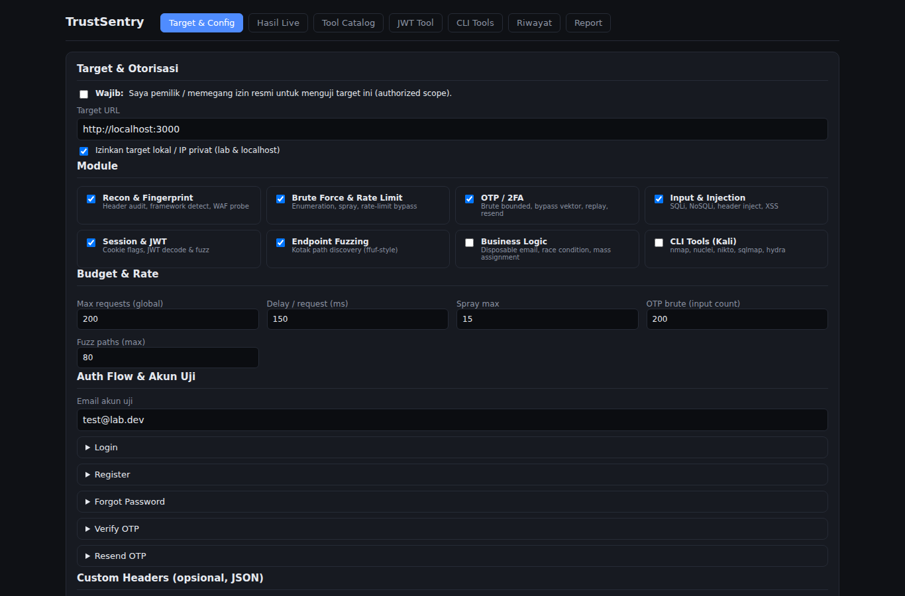
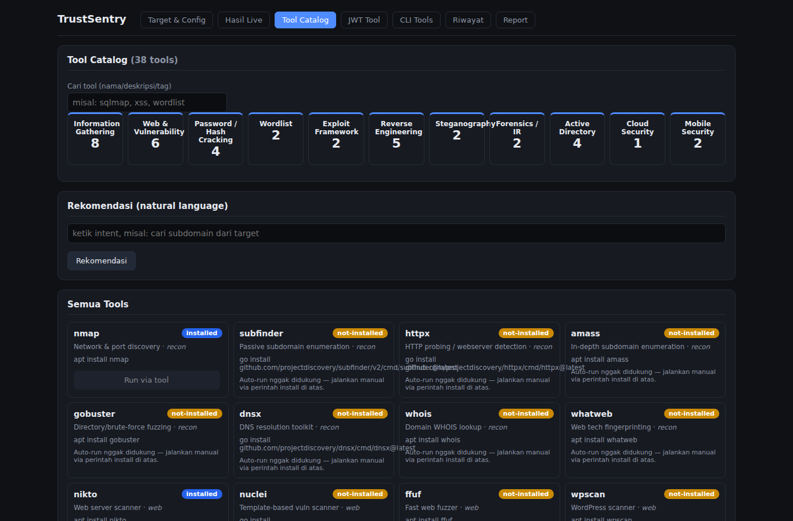

# TrustSentry

**TrustSentry** — Web-based security testing toolkit for authentication workflows (register, login, OTP, reset-password) against **authorized targets**. Built for penetration testers, bug-bounty hunters, and security engineers who want a browser-driven scanner with the depth of a manual pentest.


> ⚠️ **Authorized use only.** TrustSentry is designed for testing systems you own or are explicitly authorized to test. Unauthorized scanning or attacking targets is illegal.

## Screenshots

| Target & Config | Tool Catalog |
|---|---|
|  |  |

## Features

| Module | What it tests |
|---|---|
| **Recon & Fingerprint** | Security headers audit, framework detection, WAF probe |
| **Brute Force & Rate Limit** | User enumeration, password spraying, rate-limit bypass (header spoof), timing-attack analysis |
| **OTP / 2FA** | Bounded brute-force, bypass vectors (type-juggling/coercion), replay/expiry, resend-cooldown abuse |
| **Injection** | SQLi (error + time-based), NoSQLi, email CRLF injection, reflected XSS |
| **Session & JWT** | Cookie flags audit, JWT decode & security analysis |
| **Endpoint Fuzzing** | ffuf-style path discovery |
| **Business Logic** | Disposable-email detection, register race-condition (TOCTOU) |
| **CLI Tools** | Wired binaries with install detection: `nmap`, `nuclei`, `nikto`, `sqlmap`, `hydra` |

Other highlights:
- **Live results** via SSE streaming (request-by-request progress + findings)
- **Budget & scope guardrails**: request budget, rate limit, private-IP control
- **Professional reports**: HTML, JSON, and PDF export (risk summary, severity-colored findings, evidence appendix, out-of-scope coverage section)
- **Run history** persisted locally
- **Tool catalog** with install detection + natural-language tool recommendation

## Tech Stack

- Backend: Node.js + Express (CommonJS)
- Frontend: React 18 + Vite
- Reports: jsPDF + jspdf-autotable
- Data: local JSON store (`server/data/runs.json`)

## Getting Started

Requirements: Node.js 20+ (nvm/blob worked on Ubuntu 20.04 WSL).

```bash
# Install dependencies
cd server && npm install
cd ../web && npm install

# Run backend + frontend together (one terminal)
cd ..
npm run dev
```

Open http://localhost:5173 — backend runs on http://localhost:4000 (bound to 127.0.0.1).

### Using the CLI-tools module

The CLI module executes binaries on the host, whitelisted to the built-in list.
Install any of them when prompted:

```bash
sudo apt install nmap hydra nikto sqlmap
# nuclei (not in Ubuntu repos):
go install github.com/projectdiscovery/nuclei/v3/cmd/nuclei@latest
```

### Testing

`npm test` runs the integration suite (mock auth target + assertion-based regression checks).

## Project Layout

```
server/            Express backend (SSE streaming, modules, report/store)
web/               React + Vite frontend (config, live results, catalog, report)
test/              mock target + integration test
scripts/           dev launcher + WSL start/stop scripts
```

## Security Notes

- The HTTP API is designed for local use and binds to `127.0.0.1` by default (`HOST` env to override).
- Every run requires explicit `authorized: true` confirmation; out-of-scope targets are refused by the SSRF scope guard when private ranges are blocked.

## License

[MIT](LICENSE) © Farhad Husein Alatas